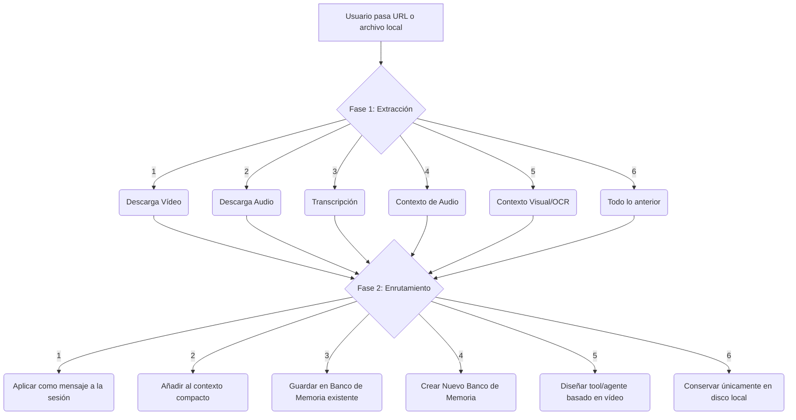

# Video Intake Knowledge 🎬

> **Habilidad Universal multi-entorno (`SKILL.md`) para ingesta, análisis, transcripción y enrutamiento de conocimiento a partir de vídeos.**  
> Compatible de forma nativa con **Hermes Agent, OpenCode, Antigravity (AGY), Claude Code, Codex y Cursor**.

---

## 🎯 Filosofía "Menos es Más"

Este repositorio implementa una Habilidad de Agente (*Skill*) siguiendo el principio estricto de **Single Source of Truth (SSoT)**. 
- **Universalidad real:** En lugar de depender de "plugins" específicos, YAMLs cerrados o adaptadores pesados para cada entorno, utilizamos un único archivo universal `skill/SKILL.md`.
- **Integración instantánea:** Los agentes leen las directivas del `SKILL.md` e invocan comandos de terminal nativos (`video-intake`) sin intermediarios, eliminando alucinaciones y fallos de invocación.
- **Resiliencia ante redes cerradas:** Integra `yt-dlp` manejando bloqueos WAF (Instagram, TikTok) de forma elegante, descargando subtítulos nativos (0 GPU) y delegando OCR a `tesseract`.
- **Cero basura en Git:** No incluye bases de datos empaquetadas.

---

## 🚀 Flujo Operativo en 2 Fases

Cuando el usuario comparte una URL de vídeo (**YouTube, Facebook, Instagram, TikTok**) o archivo local, la herramienta orquesta este flujo interactivo:



---

## 📦 Instalación

Hemos unificado la instalación en un solo script inteligente. Detecta tus entornos (Hermes, OpenCode, Cursor, etc.) y enlaza la *Skill* automáticamente.

```bash
git clone https://github.com/aibos/video-intake-knowledge
cd video-intake-knowledge
./install.sh
```

**Requisitos previos recomendados:**
- Python 3.10+
- `ffmpeg` (Para conversión y fotogramas: `sudo apt install ffmpeg`)
- `tesseract` (Para visión y OCR: `sudo apt install tesseract-ocr tesseract-ocr-spa`)

---

## 💻 Uso

### 1. Automático (A través de tu Agente IA)
Simplemente dile a tu agente (Hermes, OpenCode, AGY, etc.):
> *"Mira este vídeo: https://youtu.be/..."*

El agente detectará la URL, leerá la directiva de la Skill y abrirá de forma automática la consola interactiva en segundo plano para presentarle las opciones de la Fase 1.

### 2. Manual (Vía Terminal)
Puedes orquestar vídeos directamente sin necesidad de usar un agente:

```bash
# Modo interactivo en 2 Fases
video-intake interactive "https://www.youtube.com/watch?v=VIDEO_ID"

# O con archivos locales
video-intake interactive "./mi_video_demo.mp4"
```

### 3. Comandos de utilidad CLI
```bash
# Diagnóstico de salud y dependencias del sistema
video-intake doctor

# Inspeccionar metadatos crudos sin descargar
video-intake inspect "https://www.youtube.com/watch?v=VIDEO_ID"

# Ejecutar un trabajo en background de forma desatendida (ej. extraer transcripción y OCR)
video-intake extract "https://youtu.be/..." --select 3,5
```

---

## 📂 Estructura del Repositorio

- `skill/SKILL.md` : **El cerebro.** Única directiva maestra inyectada a los agentes.
- `install.sh` : Autodescubrimiento y vinculación de entornos.
- `packages/video_intake_core/` : Núcleo modular de extracción (audio, vision, ocr, memory, orchestrator).
- `tests/` : Suite completa de testing e2e y unitario garantizando 0 chapuzas.
- `adapters/cursor/` : Archivo `.cursorrules` para compatibilidad IDE nativa.

---

## 🛡️ Estándar de Seguridad "Cero Chapuzas"
- **Gestión WAF Nativa:** Caídas gráciles ante muros anti-bot (Instagram 403 Forbidden). Si se requieren cookies, `video-intake` informa limpiamente del bloqueo sin colapsar el sistema.
- **Protección Prompt Injection:** Neutralización y desinfección de textos extraídos por OCR o transcripciones antes de alimentarlos a modelos de IA.
- **100% de Tests:** El backend de orquestación y CLI están verificados al máximo rigor.

---
## 📄 Licencia
Apache-2.0
