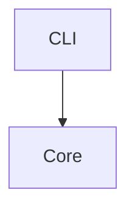

# Video Intake Knowledge 🎬

> **Habilidad Universal multi-entorno (`SKILL.md`) para ingesta, análisis, transcripción y enrutamiento de conocimiento a partir de vídeos.**  
> Compatible de forma inmediata con **Hermes Agent, AGY, OpenCode, Claude Code, Codex, Cursor** y terminales CLI estándar.

---

## 🎯 ¿Qué es este repositorio?

Es una **Habilidad de Agente (Skill) estandarizada compatible con `SKILL.md`** equipada con scripts y herramientas CLI autónomas.
- **Por qué Skill:** Es la interfaz universal que entienden todos los entornos modernos de agentes de IA sin atarse a una API de plugin propietaria.
- **Principio "Menos es Más":** Máxima simplicidad radical, alta robustez y velocidad, sin capas intermedias superfluas ni costes innecesarios de APIs de IA especializadas cuando se puede resolver con herramientas locales de alta calidad.
- **Cero bancos de memoria en Git:** El repositorio de GitHub **no contiene ningún banco de memoria ni base de datos preempaquetada**. El almacenamiento de memoria o banco de ideas es independiente y se aloja en el entorno del usuario (`~/.video-intake/memory/` o la memoria nativa del agente anfitrión).

---

## 🚀 Flujo Operativo en 2 Fases

Cuando el usuario comparte uno o varios enlaces de vídeo (**YouTube, Facebook, Instagram, TikTok**) o archivos locales (**MP4, MOV, MKV, WebM, AVI, M4V**):

### Fase 1: Preguntar qué extraer del vídeo
El sistema pregunta al usuario qué desea extraer (pudiendo seleccionar 1, varios o todos):
- `[1]` Descarga del vídeo de manera local
- `[2]` Descarga del audio del vídeo de manera local
- `[3]` Transcripción de audio (con timestamps)
- `[4]` Contexto basado en audio (resumen, puntos clave y tópicos)
- `[5]` Contexto extraído de manera visual (diagramas de flujo, esquemas, animaciones o interfaces vía OCR)
- `[6]` Todo lo anterior

El sistema ejecuta la extracción priorizando herramientas locales gratuitas y de máximo rendimiento:
- `yt-dlp` y `ffmpeg` para descarga y procesado directo.
- Subtítulos oficiales nativos de la plataforma (0 GPU, 0 coste, máxima fidelidad).
- Whisper local (si está instalado en el host).
- `tesseract` para OCR de esquemas y texto en pantalla.

### Fase 2: Preguntar el destino del conocimiento extraído
Una vez completada la extracción y generados los artefactos, el sistema pregunta qué hacer con el contenido:
- `[1]` **Aplicarlo como mensaje** a la sesión en curso.
- `[2]` **Añadirlo al contexto** de la sesión en curso (resumen compacto).
- `[3]` **Añadirlo a un banco de memoria existente** (ej. *Banco de Ideas* / ideas bank, listando los disponibles para elegir).
- `[4]` **Crear un nuevo banco de memoria** para añadirlo de forma aislada.
- `[5]` **Diseñar y crear una herramienta, tool, skill o agente** con el conocimiento extraído (analiza el contenido y muestra propuestas reales y viables).
- `[6]` **Conservar únicamente los artefactos locales** en disco.

---

## 📦 Instalación Rápida

### Instalador automático
```bash
git clone https://github.com/aibos/video-intake-knowledge
cd video-intake-knowledge
./install.sh
```

### Opciones de integración con entornos de agentes:
```bash
./install.sh --hermes       # Instala skill y plugin en Hermes Agent (~/.hermes)
./install.sh --agy          # Vincula skill en AGY (~/.agy)
./install.sh --claude-code  # Vincula skill en Claude Code (~/.claude)
./install.sh --opencode     # Vincula skill en OpenCode (~/.opencode)
./install.sh --codex        # Vincula skill en Codex (~/.codex)
./install.sh --all          # Vincula en todos los entornos detectados
```

---

## 💻 Uso Directo

### 1. Orquestador interactivo en 2 fases
```bash
# Modo interactivo (te pide la URL o ruta y te guía paso a paso)
python3 scripts/interactive.py

# O pasando el vídeo directamente:
python3 scripts/interactive.py "https://www.youtube.com/watch?v=VIDEO_ID"
```

### 2. Extracción directa con scripts utilitarios
```bash
# Extraer todo (opción 6)
python3 scripts/extract.py "https://www.youtube.com/watch?v=VIDEO_ID" -s 6

# Extraer solo audio y transcripción (opciones 2 y 3)
python3 scripts/extract.py "./mi-video.mp4" -s 2,3
```

### 3. CLI completa `video-intake`
```bash
# Diagnóstico de salud y dependencias
video-intake doctor

# Inspeccionar metadatos sin descargar
video-intake inspect "https://www.youtube.com/watch?v=VIDEO_ID"

# Extracción mediante CLI
video-intake extract "https://www.youtube.com/watch?v=VIDEO_ID" --select 1,2,3,4,5

# Ver estado de trabajos y exportar
video-intake status <JOB_ID>
video-intake export <JOB_ID> --format markdown
```

---

## 📂 Estructura Limpia del Repositorio

```text
video-intake-knowledge/
├── SKILL.md                 # Especificación canónica de la Skill para agentes
├── install.sh               # Instalador universal automático
├── pyproject.toml           # Configuración del paquete y dependencias
├── scripts/
│   ├── interactive.py       # Orquestador interactivo en 2 fases
│   ├── extract.py           # Utilidad de extracción directa
│   ├── doctor.sh            # Diagnóstico del entorno
│   ├── bootstrap.sh         # Bootstrap de dependencias
│   └── verify-install.sh    # Verificación de instalación
├── packages/
│   └── video_intake_core/   # Núcleo del motor de extracción
│       ├── acquisition/     # Detección y descarga (YouTube, FB, IG, TikTok, local)
│       ├── audio/           # Extracción y conversión de audio
│       ├── transcription/   # Subtítulos oficiales y modelos Whisper
│       ├── visual/          # Detección de keyframes y escenas
│       ├── ocr/             # Extracción de texto con Tesseract
│       ├── context/         # Generación de resúmenes de audio y visuales
│       ├── memory/          # Conectores a bancos de memoria externos
│       ├── jobs/            # Gestión del ciclo de vida de trabajos
│       ├── security/        # Protección SSRF y neutralización de prompt injection
│       └── cli/             # Interfaz de línea de comandos
├── config/                  # Plantillas de configuración (default, offline, low-cost)
├── adapters/                # Enlaces de compatibilidad para Hermes, AGY, Claude, etc.
└── tests/                   # Suite completa de tests unitarios, contract, e2e y seguridad
```

---

## 🛡️ Seguridad y Robustez
- **Protección SSRF O(1):** Algoritmo de filtrado por rangos de red IP en tiempo de validación (evita desbordamiento de memoria por precomputación de rangos).
- **Tratamiento como datos no confiables:** Todo texto procedente de transcripciones o OCR pasa por filtros de neutralización de Prompt Injection antes de inyectarse en modelos de IA.
- **Sanitización de archivos:** Prevención estricta de secuencias de path traversal (`../`).

---

## 🧪 Verificación y Tests

Ejecutar la suite completa de pruebas:
```bash
./venv/bin/pytest -v --no-cov
```

Para análisis de formato y linting:
```bash
./venv/bin/ruff check .
```

---

## 📄 Licencia

Apache-2.0

## Arquitectura


